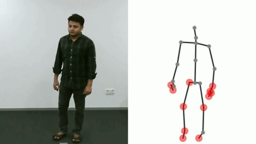
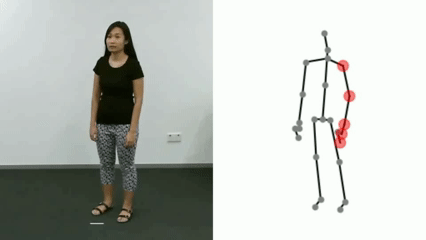

# Hyper-GCN
This repo is the official implementation for [Adaptive Hyper-Graph Convolution Network for Skeleton-based Human Action Recognition with Virtual Connections](https://arxiv.org/pdf/2411.14796). The paper is accepted to ICCV 2025 :tada::tada::tada:

# Illustration
<div align='center'>
   <br>
</div>
<!--  -->

**Illustration of Hyper-GCN.** 
In (a), dotted lines represent the virtualconnections. Each coloured part containing multiple joints represents a hyper-graph with hyper-edges. 
(b) provides an intuitive comparison between normal graph convolution and hyper-graph convolution operations with the same connectivity degree.

# Framework
<div align='center'>
   <br>
</div>

**The framework of Hyper-GCN.**
Part (a) represents the Multi-head Hyper-graph Convolution (M-HGC) module.
Part (b) represents the process of constructing an adaptive hyper-graph.
Part (c) represents the architecture of Hyper-GCN.

# Visualization
|  |  |  |  |
|:------------:|:------------:|:------------:|:------------:|
|*Drink water*|*Stand up*|*Clapping*|*Jump up*|
|  |  |  |  |
|*Neck pain*|*Wipe face*|*Hopping*|*Kicking something*|

There are some selected actions for visualizing the hyper-graph constructed by Hyper-GCN.

# Prerequisites
- Python == 3.9
- PyTorch == 1.13.0
- torchpack == 0.2.2
- numpy == 1.26.4
- PyYAML, tqdm, tensorboardX, matplotlib, sklearn, h5py, opencv
- Run `pip install -e torchlight`

We provide the dependency file of our experimental environment, you can install all dependencies by creating a new anaconda virtual environment and running `pip install -r requirements.txt `

# Data Preparation

### Download datasets.

#### There are 3 datasets to download:

- NTU RGB+D 60 Skeleton
- NTU RGB+D 120 Skeleton
- NW-UCLA

#### NTU RGB+D 60 and 120

1. Request dataset here: https://rose1.ntu.edu.sg/dataset/actionRecognition
2. Download the skeleton-only datasets:
   1. `nturgbd_skeletons_s001_to_s017.zip` (NTU RGB+D 60)
   2. `nturgbd_skeletons_s018_to_s032.zip` (NTU RGB+D 120)
   3. Extract above files to `./data/nturgbd_raw`

#### NW-UCLA

1. Download dataset from [here](https://www.dropbox.com/s/10pcm4pksjy6mkq/all_sqe.zip?dl=0)
2. Move `all_sqe` to `./data/NW-UCLA`

### Data Processing

#### Directory Structure

Put downloaded data into the following directory structure:

```
- data/
  - NW-UCLA/
    - all_sqe
      ... # raw data of NW-UCLA
  - ntu/
  - ntu120/
  - nturgbd_raw/
    - nturgb+d_skeletons/     # from `nturgbd_skeletons_s001_to_s017.zip`
      ...
    - nturgb+d_skeletons120/  # from `nturgbd_skeletons_s018_to_s032.zip`
      ...
```

#### Generating Data

- Generate NTU RGB+D 60 or NTU RGB+D 120 dataset:

```
 cd ./data/ntu # or cd ./data/ntu120
 # Get skeleton of each performer
 python get_raw_skes_data.py
 # Remove the bad skeleton 
 python get_raw_denoised_data.py
 # Transform the skeleton to the center of the first frame
 python seq_transformation.py
```


# Training & Testing

### Training

- We provide the training configs for base and large version in 4 modalities (joint, bone, joint motion and bone motion) for each benchmark. 
You can change the config file depending on what you want. As a example for base version on NTU120 X-Sub with device 0:

```
# train for modality joint
python main.py --config config/base/nturgbd120-cross-subject/hyper_joint.yaml --work-dir <the save path of results> --device 0
# train for modality bone
python main.py --config config/base/nturgbd120-cross-subject/hyper_bone.yaml --work-dir <the save path of results> --device 0
# train for modality joint motion
python main.py --config config/base/nturgbd120-cross-subject/hyper_joint_motion.yaml --work-dir <the save path of results> --device 0
# train for modality bone motion
python main.py --config config/base/nturgbd120-cross-subject/hyper_bone_motion.yaml --work-dir <the save path of results> --device 0
```

### Testing

- You can test the trained models saved in `<the save path of results>` as the follow command:

```
python main.py --config <the save path of results>/config.yaml --work-dir <the save path of results> --phase test --save-score True --weights <the save path of results>/xxx.pt --device 0
```

- If you want to ensemble the results of 4 modalities for the final result, run the following command (As a example for base version on NTU120 X-Sub): 
```
python ensemble.py --datasets ntu120/xsub --model base --joint-dir <the save path of result on joint> --bone-dir <the save path of result on bone> --joint-motion-dir <the save path of result on joint motion> --bone-motion-dir <the save path of result on bone motion>
```

# Pretrained Models

We provide the pretrained weights, configs and training logs. 
You can download pretrained models for producing the final results on NTU 60 & 120 in [Google Drive](https://drive.google.com/drive/folders/1Zi6l8NL_mp7I7v8FjizlRNTk7wZlNfkQ?usp=sharing).

## Acknowledgements

- This repo is based on [CTR-GCN](https://github.com/Uason-Chen/CTR-GCN).

- The data processing is borrowed from [SGN](https://github.com/microsoft/SGN) and [HCN](https://github.com/huguyuehuhu/HCN-pytorch).

- The training strategy is referenced from [BlockGCN](https://github.com/ZhouYuxuanYX/BlockGCN), [SkateFormer](https://github.com/KAIST-VICLab/SkateFormer/tree/main) and [PYSKL](https://github.com/kennymckormick/pyskl)

Thanks to the original authors for their work!


# Contact
For any questions, feel free to contact: `youwei_zhou@stu.jiangnan.edu.cn`
